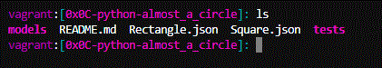

# Holberton-Utils
Simple tools for new configuration for holberton if you have new laptop or somenthing else.

## Generate ssh key for github

Run script and press enter, and enter, and enter. And copy all ssh-rsa, put the new ssh in github and run the command

### ssh -T git@github.com

## install_python3.sh

simple script to change the python for 3.4.3 for Holberton.

## Modify the style of your promt

Go to the cd $HOME and open the .bashrc, paste the new config on the end of the file and run source ./.bashrc for restart changes. Enjoy

http://ezprompt.net/

My fav config, for now.

LS_COLORS="di=1;35:ex=4;31:*.mp3=1;32;41"
export PS1="\[\033[38;5;5m\]\u\[$(tput sgr0)\]\[\033[38;5;15m\]:\[$(tput sgr0)\]\[\033[38;5;6m\][\[$(tput sgr0)\]\[\033[38;5;13m\]\W\[$(tput sgr0)\]\[\033[38;5;6m\]]:\[$(tput sgr0)\]\[\033[38;5;15m\] \[$(tput sgr0)\]"

## Hipposcraper  

The Hipposcraper automates file template creation for Holberton projects. The program takes a link to a Holberton School project, scrapes the webpage, and creates the corresponding directory and files. The Hipposcraper currently supports the following

https://github.com/kai-dg/hipposcraper
